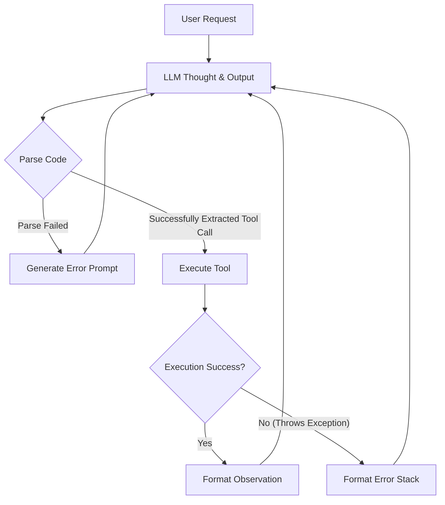
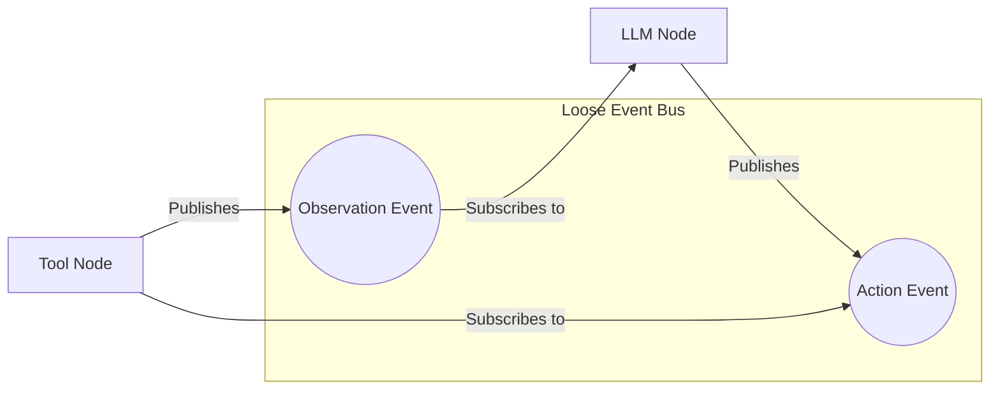

# Language Anchoring Protocol (LAP)

**A humble attempt at a universal semantic contract and processing protocol for AI agent workflows.**

[]()
[]()
[中文文档 (Chinese)](README_zh.md)

*I urgently need professional feedback and community validation. See the "Seeking Professional Validation" section.*

---

## 1. What is LAP?

Is it a protocol? Yes.
Is it in its final, complete form? Not yet. 

However, its core definition is very clear: **When data enters a processing node, it must conform to a specific semantic format; when it exits, it must conform to another specific semantic format.**

Simply put, it's like a **"Import/Export Standard"** for AI workflows: it dictates what the data must look like when it **enters** and what it must become when it **exits**, ensuring the AI's processing is no longer "flying blind."

In LAP, every step of an AI workflow is treated as an **"Anchor"**. Its role is to take the probabilistic, "best guess" output of an LLM and "anchor" it—like dropping a heavy anchor to steady a ship—into a deterministic format with specific semantics required by the downstream system.

```text
Anchor = (Format_In, Validator → Verdict → Route) → Format_Out
```

### 1.1 Core Traits
*   **Atomization of Semantics:** Decomposes complex processing flows into indivisible semantic transformations.
*   **Universal Applicability:** A requirement is a requirement, regardless of where it comes from (a chat, a ticket, or an issue).
*   **Readability & Macro-Neural Potential:** With atomic operations and routing capabilities, it operates on *semantics* rather than mathematical computation. It has the potential to become a carrier for **Semantic Neural Networks**.

### 1.2 Architecture Comparison: Why LAP?

To better understand the problem LAP solves, let's compare the architectural differences between Traditional Agents, standard Event Bus Agents, and LAP-driven Agents.

#### 1. Traditional Agent (Hardcoded Loop)
Traditional Agents (like early ReAct implementations) are often wrapped in a massive `while` loop filled with `if/else` statements. Business logic, error handling, and parsing logic are tightly coupled, making it hard to debug and even harder to extend.


#### 2. Standard Event Bus Agent (e.g., OpenHands)
To decouple the system, modern frameworks introduce an Event Bus. The LLM and tools are split into independent consumers. While decoupled, **the data flowing on the bus lacks strong semantic contracts** (often just loose JSON dictionaries). Nodes rely on implicit agreements, leading to frequent "implicit type errors."


#### 3. LAP-Driven Agent (Semantic Contract Bus)
Building upon the event bus, LAP introduces **unbypassable Security Checkpoints (Anchors)** and **strict type tags (Format)**. Any output must be verified, and the Verdict determines the data's routing. This provides the system with robust type safety and a native self-healing feedback loop.
```mermaid
graph TD
    subgraph LAP Type-Safe Bus
        S[[Format: agent-state]]
        A[[Format: agent-action]]
        O[[Format: tool-observation]]
    end

    subgraph LLM Checkpoint (Soft)
        Val1{LLM Intent Verdict}
        Val1 -- PASS (Task Complete) --> Emit[Final Answer]
        Val1 -- FAIL (Needs Tool Call) --> A_out[Output Tagged Action]
    end

    subgraph Tool Checkpoint (Hard)
        Val2{Execution & Syntax Check}
        Val2 -- PASS (Success) --> O_out[Output Observation]
        Val2 -- FAIL (With Diagnosis) --> O_out
    end
    
    S -- Validated Match --> Val1
    A_out -. Inject to Bus .-> A
    A -- Validated Match --> Val2
    O_out -. Inject to Bus .-> O
    O -. Transformer Morpher .-> S
    
    style S fill:#d4edda,stroke:#28a745,stroke-width:2px
    style A fill:#fff3cd,stroke:#ffc107,stroke-width:2px
    style O fill:#cce5ff,stroke:#007bff,stroke-width:2px
```

---

## 2. Familiar Concepts, Reimagined

To demonstrate the elegance of LAP, consider how it reimagines the familiar **ReAct/CodeAct loop (e.g., the core logic of OpenHands)**.

In traditional hardcoded implementations, this is often a complex `while` loop cluttered with `if/else` statements. Under the LAP Event Bus architecture, it is simply three extraordinarily clean semantic nodes:

1.  **Context (Transformer Node):**
    *   **Semantic Contract:** `tool-observation` → `agent-state`
    *   **Logic:** Transforms raw tool outputs into a context state the LLM can process.
2.  **LLM (Soft Anchor):**
    *   **Semantic Contract:** `agent-state` → `agent-action`
    *   **Routing:** The LLM yields a Verdict. If it decides the task is complete (PASS), it Emits. If it issues a tool call (FAIL), it routes to the next Hard Anchor.
3.  **Tool (Hard Anchor):**
    *   **Semantic Contract:** `agent-action` → `tool-observation`
    *   **Self-Healing:** Whether the tool succeeds (PASS) or fails with an error (FAIL with Diagnosis), LAP routes it back to the `Context` node. The LLM natively reads the Diagnosis in the next tick to self-heal.

This paradigm **completely decouples "business implementation" from "semantic contracts."**

---

## 3. The Vision: Event Bus & Semantic Contracts

Current graph mappings are often too rigid for truly autonomous agents. We believe the best architectural form is an **Event Bus**. 

LAP serves as the semantic type system that flows over this Event Bus. It doesn't dictate *how* an agent thinks; it dictates *what semantic contracts* the agent's inputs and outputs must adhere to. This allows different agents to collaborate seamlessly, mutually verifying outputs and evolving at a systemic level.

---

## 4. Seeking Professional Validation

This architecture was driven by personal pain points in projects like OmniFactory. However, a true "Protocol" must withstand rigorous scrutiny. Senior engineers often raise two concerns:
1.  **State Explosion & Deadlocks**: How to prevent context overflow when an LLM repeatedly fails?
2.  **Concurrency & Consistency**: How to prevent "dirty writes" on a decentralized bus?

**LAP's Answer: Turn "engineering problems" into "semantic modeling problems."**

In LAP, all inconsistencies are fundamentally **Missing Semantic Types** (Type Errors):
*   **For State Explosion**: We simply define a `Hard Anchor: Length Checker`. If the state is too long (FAIL), it routes to a `Transformer: Context Compressor`.
*   **For Concurrency**: We don't rely on the Agent's "verbal claim"; we rely on a **verified Git PR**. 

This leads to a crucial meta-definition: **The Ground Truth Surface**.

This concept might sound mysterious, but it simply refers to **"Who has the final say?"**. In the LAP space, confidence (Confidence = 1.0) can only originate from strict external truths, not LLM claims:
*   **Existing Code / Git States** (Code-source Truth)
*   **The Internet** (Human-source Truth)
*   **Sensors and Actuator Returns** (Physical-source Truth)
*   **Compilers and Mathematical Theorems** (Logical-source Truth)

All Soft Anchors (LLMs) are merely probabilistic attempts striving to collapse into the Hard Anchors (Ground Truths).

---

## 5. Specifications and Standard Library

*   **[LAP Standard Semantic Library](specifications/LAP_STANDARD_LIBRARY_en.md)** - The "MIME Types" of the protocol.
*   [LAP V0.1 Specification (English)](specifications/LAP_V0.1_en.md) - Foundational theory.
*   [LAP V0.2 Specification (English)](specifications/LAP_V0.2_en.md) - Advanced routing, Tag system, and the Ground Truth Surface.

---

## 6. Reference Implementation

The first reference implementation (including the Event Bus and Evolution Engine) is currently being developed and validated within the **OmniFactory** project.
