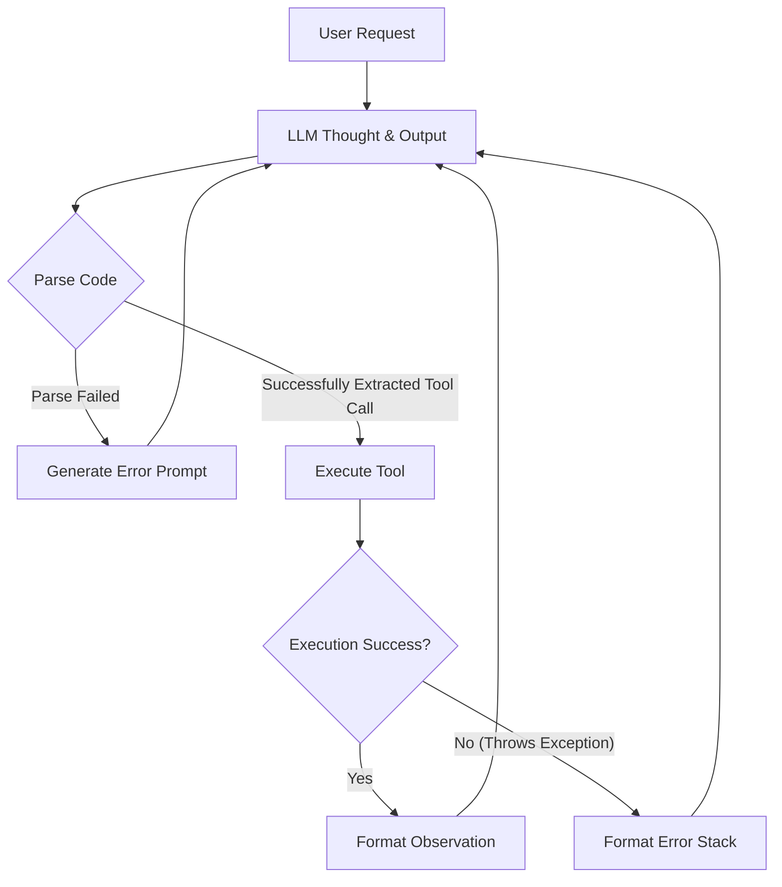
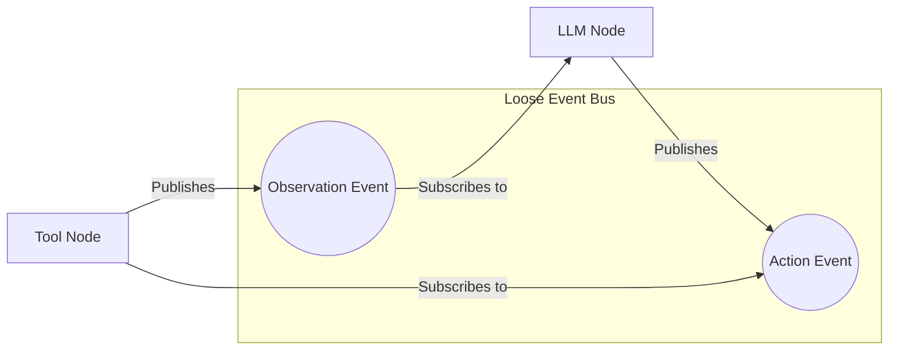
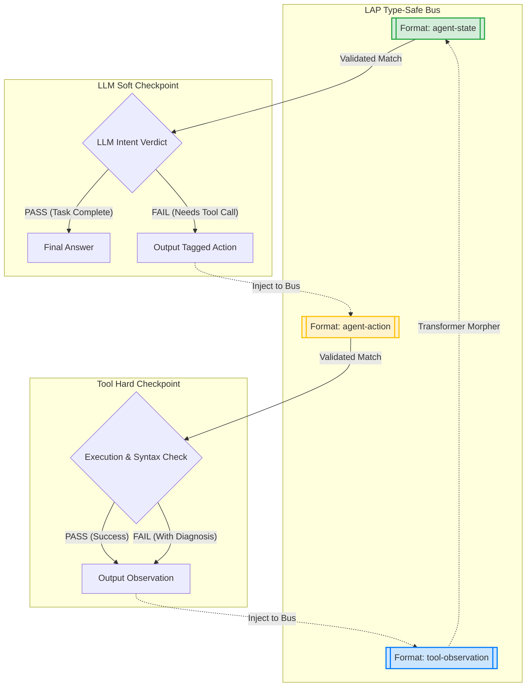

# Language Anchoring Framework (LAP)

**A design framework for building type-safe, verifiable AI agent workflows — inspired by Design by Contract and typed dataflow.**

[]()
[]()
[]()
[]()

[中文文档 (Chinese)](README_zh.md) · [GitHub](https://github.com/ColorC/language-anchoring-protocol)

*Feedback welcome — see the "Known Limitations & Open Questions" section.*

---

## 1. What is LAP?

> **⚠️ Experimental Status**: LAP is an early-stage design framework. The type system, semantic relations, and runtime primitives are hypotheses under active validation in the [OmniFactory](https://github.com/ColorC/omnifactory) project. This repository contains **definitions and reference code only** — production implementation and testing happen in OmniFactory.

LAP is a set of design patterns and primitives for structuring AI agent workflows. It is not yet a full protocol specification — it is closer to an **architecture pattern** that may evolve into a protocol with community input and validation.

Its core definition is clear: **When data enters a processing node, it must conform to a specific semantic format; when it exits, it must conform to another specific semantic format.**

Simply put, it's like a **"Import/Export Standard"** for AI workflows: it dictates what the data must look like when it **enters** and what it must become when it **exits**, ensuring the AI's processing is no longer "flying blind."

In LAP, every step of an AI workflow is treated as an **"Anchor"**. Its role is to take the probabilistic, "best guess" output of an LLM and "anchor" it—like dropping a heavy anchor to steady a ship—into a deterministic format with specific semantics required by the downstream system.

```text
Anchor = (Format_In, Validator → Verdict → Route) → Format_Out
```

### 1.1 Core Traits
*   **Atomization of Semantics:** Decomposes complex processing flows into indivisible semantic transformations.
*   **Universal Applicability:** A requirement is a requirement, regardless of where it comes from (a chat, a ticket, or an issue).
*   **Readability & Composability:** With atomic operations and routing capabilities, pipelines are human-readable and composable, making them easy to reason about, debug, and extend.

### 1.2 Architecture Comparison: Why LAP?

To better understand the problem LAP solves, let's compare the architectural differences between Traditional Agents, standard Event Bus Agents, and LAP-driven Agents.

#### 1. Traditional Agent (Hardcoded Loop)
Traditional Agents (like early ReAct implementations) are often wrapped in a massive `while` loop filled with `if/else` statements. Business logic, error handling, and parsing logic are tightly coupled, making it hard to debug and even harder to extend.


#### 2. Standard Event Bus Agent (e.g., OpenHands)
To decouple the system, modern frameworks introduce an Event Bus. The LLM and tools are split into independent consumers. While decoupled, **the data flowing on the bus lacks strong semantic contracts** (often just loose JSON dictionaries). Nodes rely on implicit agreements, leading to frequent "implicit type errors."


#### 3. LAP-Driven Agent (Semantic Contract Bus)
Building upon the event bus, LAP introduces **unbypassable Security Checkpoints (Anchors)** and **strict type tags (Format)**. Any output must be verified, and the Verdict determines the data's routing. This provides the system with robust type safety and a native self-healing feedback loop.


---

## 2. Familiar Concepts, Reimagined

To demonstrate the elegance of LAP, consider how it reimagines the familiar **ReAct/CodeAct loop (e.g., the core logic of OpenHands)**.

In traditional hardcoded implementations, this is often a complex `while` loop cluttered with `if/else` statements. Under the LAP Event Bus architecture, it is simply three extraordinarily clean semantic nodes:

1.  **Context (Transformer Node):**
    *   **Semantic Contract:** `tool-observation` → `agent-state`
    *   **Logic:** Transforms raw tool outputs into a context state the LLM can process.
2.  **LLM (Soft Anchor):**
    *   **Semantic Contract:** `agent-state` → `agent-action`
    *   **Routing:** The LLM yields a Verdict. If it decides the task is complete (PASS), it Emits. If it issues a tool call (FAIL), it routes to the next Hard Anchor.
3.  **Tool (Hard Anchor):**
    *   **Semantic Contract:** `agent-action` → `tool-observation`
    *   **Self-Healing:** Whether the tool succeeds (PASS) or fails with an error (FAIL with Diagnosis), LAP routes it back to the `Context` node. The LLM natively reads the Diagnosis in the next tick to self-heal.

This paradigm **completely decouples "business implementation" from "semantic contracts."**

---

## 3. Design Goal: Event Bus & Semantic Contracts

Current graph mappings are often too rigid for truly autonomous agents. LAP explores the **Event Bus** as an alternative architectural form.

LAP serves as the semantic type system that flows over this Event Bus. It doesn't dictate *how* an agent thinks; it dictates *what semantic contracts* the agent's inputs and outputs must adhere to. The near-term goal is to enable better observability, type-safe pipeline composition, and structured self-healing feedback loops within a single project.

> **Note on "Protocol" vs "Framework"**: Despite the repository name, LAP is currently a **design framework** (architecture pattern + reference primitives), not an interoperability protocol. The name "Language Anchoring Protocol" is retained in some references for historical continuity, but we use "Framework" to set honest expectations. Upgrading to "Protocol" status requires multi-party implementations, conformance tests, and a wire format — none of which exist yet.

---

## 4. Known Limitations & Open Questions

This architecture was driven by personal pain points in projects like OmniFactory. It has helped decouple business logic from validation concerns, but several hard problems remain open:

1.  **State Explosion & Deadlocks**: If an LLM repeatedly fails validation, the context grows unboundedly. LAP's approach is to model this as a type problem — inserting a `Length Checker` Anchor that routes to a `Context Compressor`. This is essentially equivalent to writing `if len(context) > limit: compress()`, expressed in LAP's vocabulary. Whether this reframing provides practical benefits over direct implementation remains to be validated.

2.  **Concurrency & Consistency**: Multiple agents modifying shared state (e.g., a codebase) can cause dirty writes. LAP suggests relying on external Ground Truth validators (e.g., Git state checks) as terminal Anchors. This delegates the problem to existing infrastructure rather than solving it at the framework level — an honest limitation.

3.  **Type System Gaps**: The semantic relation model (Composition, Synthesis, Transformation, Inheritance) is a hypothesis. Only Inheritance and Transformation are partially implemented in the reference code. The full relation system is being validated in OmniFactory's Evolution Engine.

4.  **Implementation-Spec Gaps**: V0.2 features (`confidence`, `granted_tags`, tag propagation, `required_tags` checking) are defined as Pydantic fields but **not yet used** by `PipelineRunner` or `PipelineChecker`. These are forward declarations awaiting OmniFactory validation.

5.  **No Tests in This Repo**: This repository contains definitions and reference code. Testing and production validation happen in the OmniFactory project.

Despite these open questions, LAP introduces one concept we believe is genuinely useful: **The Ground Truth Surface**.

This simply refers to **"Who has the final say?"** In LAP, system confidence (Confidence = 1.0) can only originate from strict external truths, not LLM self-assessment:
*   **Existing Code / Git States** (Code-source Truth)
*   **The Internet** (Human-source Truth)
*   **Sensors and Actuator Returns** (Physical-source Truth)
*   **Compilers and Mathematical Theorems** (Logical-source Truth)

All Soft Anchors (LLMs) are probabilistic attempts striving to collapse into Hard Anchors (Ground Truths). This framing helps practitioners reason about where to invest in validation within their pipelines.

---

## 5. Related Work & Inspirations

LAP builds on ideas from several established fields. We acknowledge these influences:

| Concept | Origin | LAP's Relation |
|---------|--------|----------------|
| **Design by Contract** | Eiffel (Bertrand Meyer, 1986) | Preconditions/postconditions/invariants map directly to Format_In/Format_Out/Validator |
| **Typed Dataflow** | Programming language theory | Format relations and Pipeline type-checking are applications of typed dataflow |
| **Guardrails AI** | Guardrails AI (2023) | Composable validator chains with retry — closely related to LAP's Anchor chains |
| **DSPy** | Stanford NLP (2023) | Signatures + assertions + optimization — similar typed-contract approach for LLM programs |
| **NeMo Guardrails** | NVIDIA (2023) | Dialogue policy enforcement via rails — domain-specific anchoring for conversations |
| **CloudEvents** | CNCF | Standardized event envelope — similar goal for event bus interoperability |

**What LAP adds**: A unified vocabulary (Anchor, Format, Verdict, Route) that spans all these patterns, plus a semantic relation model (Composition, Synthesis, Transformation, Inheritance) with compile-time checking. Whether this unification provides sufficient practical value over using these tools directly is the key question LAP needs to answer through real-world validation.

---

## 6. Specifications and Standard Library

*   **[LAP Standard Semantic Library](specifications/LAP_STANDARD_LIBRARY_en.md)** - The "MIME Types" of the framework.
*   [LAP V0.1 Specification (English)](specifications/LAP_V0.1_en.md) - Foundational theory.
*   [LAP V0.2 Specification (English)](specifications/LAP_V0.2_en.md) - Advanced routing, Tag system, and the Ground Truth Surface.

> **Implementation Note**: The reference implementation in `python_impl/` is a proof-of-concept companion to the specifications. Production implementation, validation, and testing are conducted in the [OmniFactory](https://github.com/ColorC/omnifactory) project.

---

## 7. Reference Implementation

The first reference implementation (including the Event Bus and Evolution Engine) is currently being developed and validated within the **OmniFactory** project.
