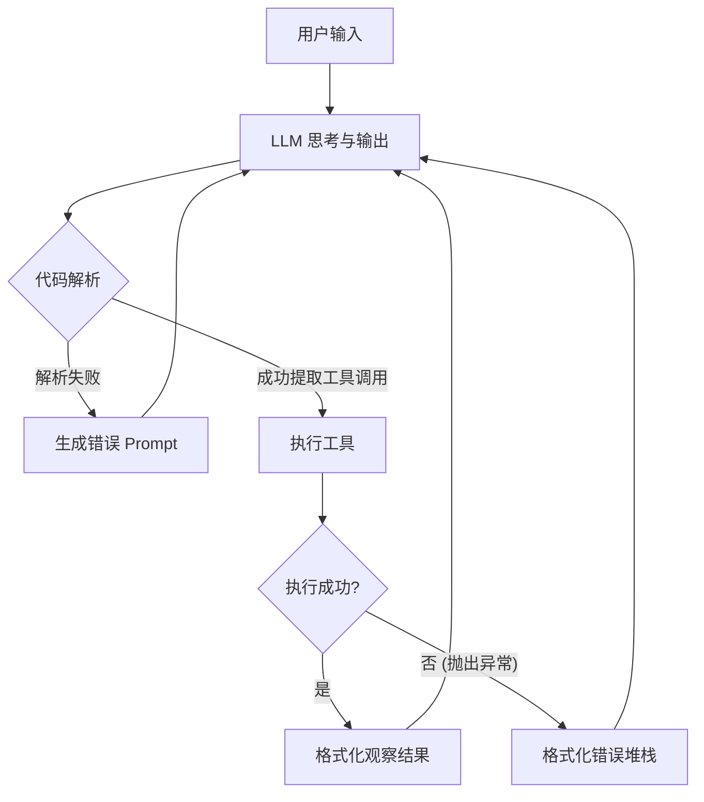
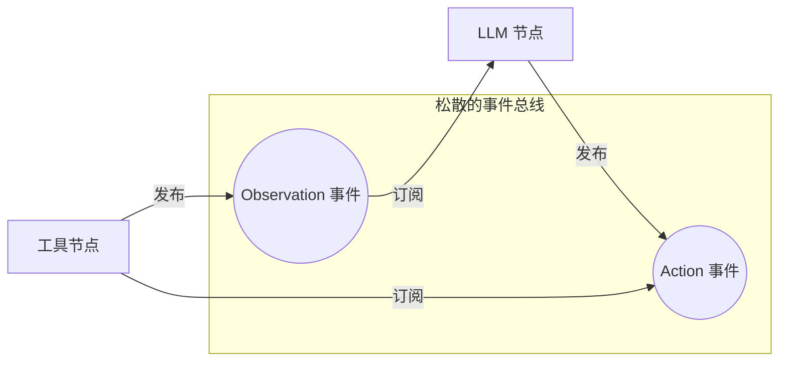
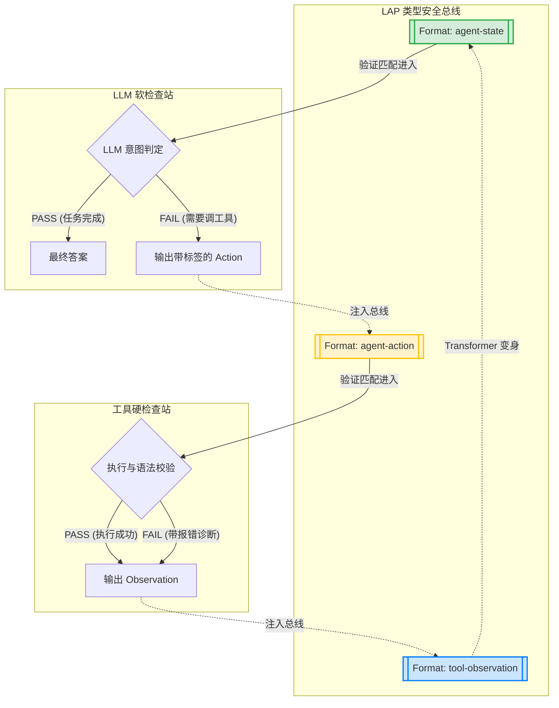

# Language Anchoring Protocol (LAP)

**一套用于构建类型安全、可验证的 AI Agent 工作流的设计框架 — 受 Design by Contract 和类型化数据流启发。**

[]()
[]()
[]()
[]()

[English Documentation](README.md) · [GitHub](https://github.com/ColorC/language-anchoring-protocol)

*欢迎反馈 — 详见”已知局限与开放问题”章节。*

## 1. LAP 到底是什么？

LAP 是一组用于构建 AI Agent 工作流的设计模式和原语。它目前还不是一个完整的协议规范——更接近于一种**架构模式（Architecture Pattern）**，未来可能通过社区参与和实践验证演化为协议。

它的核心定义很明确：**数据到达某个处理节点时，必须符合某个特定的语义；数据从某个处理节点输出时，必须符合另一个特定的语义。**

简单来说，它就像是 AI 工作流里的**“进出口标准”**：它规定了数据**进来时**得是什么样，**出去时**必须变成什么样，确保 AI 的处理过程不再是“盲跑”。

在 LAP 中，我们将这个节点称为**锚点（Anchor）**。它的作用是把大语言模型（LLM）不确定的、概率性的输出，像抛锚一样固定在下游要求的确定性结构与语义上。
```text
Anchor = (Format_In, Validator → Verdict → Route) → Format_Out
```

### 1.1 核心特性
*   **语义与语义契约原子化：** 将复杂的处理流拆解为不可分割的语义转换。
*   **极致的通用性：** 甭管哪来的需求，只要是“需求（Requirement）”就可以进入处理管线。
*   **可读性与可组合性：** 具备原子化操作和路由能力，管线定义对人类可读且易于组合，方便推理、调试和扩展。

### 1.2 架构对比：为什么我们需要 LAP？

为了更直观地理解 LAP 解决的问题，我们来对比一下传统 Agent、普通事件总线 Agent 和 LAP 驱动的 Agent 的架构差异。

#### 1. 传统 Agent (硬编码循环)
传统 Agent（如早期的 ReAct 实现）通常被包裹在一个巨大的 `while` 循环和无数的 `if/else` 中。业务逻辑、错误处理和解析逻辑高度耦合，一旦出错很难排查，也无法轻易复用。


#### 2. 普通事件总线 Agent (如 OpenHands)
为了解耦，现代框架引入了事件总线。LLM 和工具被拆分为独立的消费者。虽然解耦了，但**总线上流淌的数据缺乏强语义契约**（通常只是松散的 JSON 字典），节点之间依靠隐含的默契配合，这导致了“隐式类型错误”频发。


#### 3. LAP 驱动的 Agent (语义契约总线)
LAP 在事件总线的基础上，引入了**不可绕过的安检口（检查站 Anchor）**和**严格的类型标签（Format）**。任何输出必须经过验证，判定（Verdict）决定了数据的去向。这使得系统具备了极强的类型安全和天然的自愈反馈回路。


### 1.3 用 LAP 重新表达熟悉的概念

为了展示 LAP 的优雅性，我们来看看如何用 LAP 重新表达你最熟悉的 **ReAct/CodeAct 循环（如 OpenHands 的核心逻辑）**。

在传统的硬编码实现中，这通常是一个复杂的 `while` 循环，里面夹杂着各种 `if/else` 来处理 LLM 解析错误或工具执行错误。

而在 LAP 事件总线体系下，它只是三个极其干净的语义处理节点：

1.  **Context (Transformer 节点):**
    *   **语义契约：** `tool-observation` → `agent-state`
    *   **逻辑：** 无论什么工具输出，到达这里都必须被转换为 LLM 能理解的上下文状态。
2.  **LLM (Soft Anchor 软锚定):**
    *   **语义契约：** `agent-state` → `agent-action`
    *   **路由：** LLM 输出 Verdict。如果它决定完成任务（PASS），则将文本 Emit 出管线；如果它决定调用工具（FAIL 软校验），则路由给下一个硬锚点。
3.  **Tool (Hard Anchor 硬锚定):**
    *   **语义契约：** `agent-action` → `tool-observation`
    *   **天然可追踪与自愈：** 无论工具执行成功（PASS）还是失败遇到了 Error 堆栈（FAIL 附带 Diagnosis 诊断信息），LAP 都会将其路由回 `Context` 节点。LLM 会在下一轮中自动看到诊断信息并尝试自愈。

这种表达方式**将“业务实现”与“语义契约”完全解耦**。它极其通用、易于扩展，并且由于全程在 Event Bus 上流转，任何一个节点的 Verdict 都在天然且精细地被记录，为未来的模型微调和自我进化（Evolution Engine）提供了完美的温床。详情可查看 `examples/openhands_codeact_loop.py`。

## 2. 设计目标：事件总线 (Event Bus) 与语义契约

LAP 探索使用**事件总线（Event Bus）**作为 Agent 系统的架构形态，替代静态的图连线。

LAP 不试图规定 Agent 内部如何思考（那是 Agent 框架的事），LAP 定义的是流淌在事件总线上的**类型契约**。近期目标是在单个项目内实现更好的可观测性、类型安全的管线组合，以及结构化的自愈反馈回路。

## 3. 起源与探索

LAP 的诞生源于个人在构建 AI 应用时的一段探索与困惑。我曾尝试切换使用 Langflow、LangSmith (LangGraph)，参考过 n8n 和 Dify，研究了飞书开放平台、飞书 Anycross，甚至开始自己手写 LangGraphFlow，期间也深度阅读了像 OpenHands 这样的项目。

在这个过程中，我一直在思考一个问题：**为什么 AI 工作流有如此多样的表达形式，却缺乏一种通用的底层契约？**

我需要一种方式，能把任何需求、架构设计、代码、代码审查意见、Git 提交历史等，作为不同源但统一接口的“内容”来处理。如果没有通用契约，我就必须在诸多工具中选择一个，并对其产生极高的依赖（Vendor Lock-in）。更深层的问题在于，目前的流程图（Graph/Flow）大多是现有明确工作流的静态映射，它们其实不够灵活，无法让 Agent 真正自由地“开写”或自主决策。

虽然传统的流程图本质上也缺乏通用契约，但在大语言模型时代，处理的**核心对象统一了——都是“语言（Language）”**。既然处理对象统一了，就应该拥有一种通用的处理契约。

**我认为这个通用契约不应该有护城河。** 它太通用了。任何人对于 SOP（标准作业程序）和语义对象的理解，都应当能成为这个生态的养料。我不想让“中心化 AI 集群的自适应、高质量自动工作服务”成为少数企业的专属特权。

## 4. 已知局限与开放问题

这套架构源于个人在 OmniFactory 项目中的实践痛点。它帮助解耦了业务逻辑和验证关注点，但几个核心难题仍然是开放的：

1.  **状态爆炸与死锁**：如果 LLM 反复失败，上下文会无限增长。LAP 的做法是将其建模为类型问题——插入 `Length Checker` Anchor 路由到 `Context Compressor`。但这本质上等价于 `if len(context) > limit: compress()`，只是用 LAP 词汇表述。这种重新表述是否带来实际工程收益，有待验证。（参见 `examples/openhands_full_loop.py`）

2.  **并发与一致性（脏写）**：多个 Agent 并发修改同一代码库可能导致脏写。LAP 建议在管线末端依赖外部 Ground Truth 验证器（如 Git 状态检查）。这是将问题委托给已有基础设施，而非在框架层面解决——这是一个诚实的局限。

尽管存在这些开放问题，LAP 引入了一个我们认为有实用价值的概念：**基准真理面（Ground Truth Surface）**。

它的含义很简单：**”谁才是最后说了算的？”** 在 LAP 中，系统信心的上限（Confidence = 1.0）只能来源于严格的外部真理，而不是 LLM 的自我宣称：
*   **已有代码 / Git 状态**（代码源真理）
*   **互联网信息**（人类源真理）
*   **传感器与执行器返回**（物理源真理）
*   **数学定理与编译器**（逻辑源真理）

所有的软锚定（LLM）都是在向硬锚定（Ground Truth）逼近。这个框架帮助从业者判断在管线中的哪些位置值得投入验证资源。

如果您发现了其中的逻辑漏洞，或有相关经验想分享，欢迎提交 Issue 或参与讨论。

## 5. 相关工作与启发

LAP 的思想建立在多个成熟领域的基础之上，我们致敬这些先驱工作：

| 概念 | 来源 | LAP 的关系 |
|------|------|-----------|
| **Design by Contract** | Eiffel 语言 (Bertrand Meyer, 1986) | 前置条件/后置条件/不变量 直接映射为 Format_In/Format_Out/Validator |
| **类型化数据流 (Typed Dataflow)** | 编程语言理论 | Format 继承和 Pipeline 类型检查是类型化数据流的应用 |
| **Guardrails AI** | Guardrails AI (2023) | 可组合的验证器链 + 重试 — 与 LAP 的 Anchor 链高度相关 |
| **DSPy** | Stanford NLP (2023) | 签名 + 断言 + 自动优化 — 类似的类型化契约思路 |
| **NeMo Guardrails** | NVIDIA (2023) | 对话行为策略 — 对话场景下的领域特定锚定 |
| **CloudEvents** | CNCF | 标准化事件信封 — 事件总线互操作性的相似目标 |

**LAP 的增量贡献**：提供了一套统一词汇（Anchor、Format、Verdict、Route）来横跨上述所有模式，并附带带继承和编译期检查的类型系统。这种统一是否比直接使用上述工具提供了足够的实际价值，是 LAP 需要通过实际验证来回答的核心问题。

---

## 6. 规范文档与标准库

详细的规范位于 `specifications/` 目录下：

*   **[LAP 核心语义标准库 (中文)](specifications/LAP_STANDARD_LIBRARY_zh.md)** - 框架的”MIME Types”，定义了通用的 Format 树与语义标签表。
*   [LAP V0.1 核心规范 (中文)](specifications/LAP_V0.1_zh.md) - 基础理论与类型系统。
*   [LAP V0.2 核心规范 (中文)](specifications/LAP_V0.2_zh.md) - 高级路由、标签系统与基准真理面。

## 7. 参考实践

首个参考实现（包含 Event Bus 体系和简单的演化引擎）在 OmniFactory 项目中作为核心系统进行开发验证。
